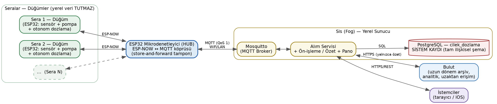

# Topraksız Tarım Çilek Yetiştiriciliği İçin Otomatik Besin Dozlama Sistemi

Hidroponik (topraksız) çilek üretiminde **pH** ve **EC** değerlerini sürekli izleyip,
büyüme evresine tanımlı hedef aralıklara göre otomatik **besin/asit/baz/su dozlaması**
yapan, **sis bilişim (fog computing)** yaklaşımıyla tasarlanmış üç katmanlı bir sistem.

- **Uç (Edge):** Her serada, **düğüm (node)** rolünde bir **ESP32 tabanlı mikrodenetleyici**;
  sensörleri okur, dozlamayı **yerel ve otonom** yürütür ve **yerel kalıcı veri tutmaz**.
  Olayları **ESP-NOW** ile çift yönlü olarak toplayıcıya iletir.
- **Sis (Fog):** **Toplayıcı (hub)** rolünde bir **ESP32 tabanlı mikrodenetleyici**, ESP-NOW
  olaylarını **MQTT**'ye köprüler ve geçici bir **store-and-forward tamponu** çalıştırır.
  Aynı katmandaki **yerel sunucu**, **veritabanı (sistem kaydı / system of record)** rolünü
  üstlenir: **PostgreSQL** + Mosquitto (MQTT) + alım servisi + pano.
- **Bulut (Cloud):** Yalnızca **özet** veri; uzun dönem arşiv, analitik ve uzaktan erişim.

Dozlama kararı düğümde verildiğinden, ağ veya yerel sunucu kesilse bile her dozlama sisteme serada güvenli çalışır.

**GitHub deposu:** https://github.com/huseyingokalp/OtomatikBesinDozlamaSistemi



## Özellikler
- Otonom dozlama: hedef aralığa göre Asit / Baz / Besin A / Besin B / Su pompalama
- pH, EC, sıcaklık ve su seviyesi izleme + eşik alarmları
- Çok düğümlü **ESP-NOW** (çift yönlü, otomatik kayıt) + **MQTT** (QoS 1) ile sis katmanı
- **Sistem kaydı:** yerel sunucu üzerinde **PostgreSQL** (tam ilişkisel şema: FK, CHECK,
  tetikleyici, görünüm); opsiyonel **TimescaleDB** ile hypertable + sürekli toplama +
  sıkıştırma + retention
- Hub'da **store-and-forward tampon** (SQLite) - kesintide veri kaybını önler
- Mobil uygulamalar: **iOS** (SwiftUI) ve **Android** (Kotlin/Jetpack Compose) + tarayıcıda çalışan **React** uygulaması/demosu (tümü yerel sunucu REST'ine bağlanır, anlık/tam veri)

## Depo Yapısı
```
.
├── firmware/
│   ├── node_esp32/    # Sensör + dozlama düğümü (veri tutmaz, ESP-NOW)
│   ├── hub_esp32/     # ESP-NOW ↔ MQTT köprüsü + store-and-forward tampon
│   └── README.md      # Donanım bağlantıları, MAC eşleme, flashlama
├── database/
│   ├── schema.sql               # Sistem kaydı: tam ilişkisel şema (PostgreSQL)
│   ├── seed.sql                 # PostgreSQL örnek verisi
│   ├── schema_sqlite.sql        # Hub store-and-forward tampon şeması (SQLite)
│   ├── schema_bulut.sql         # Bulut özet katmanı (yönetilen PostgreSQL + TimescaleDB)
│   └── YerelSunucu_PostgreSQL.md # yerel sunucuda PostgreSQL + Mosquitto kurulumu, MQTT alımı
├── diagram/           # Tüm şekillerin görselleri (.png) + şekil eşleme tablosu
├── ios/                  # iOS uygulaması - TAM Xcode projesi (SwiftUI + XcodeGen)
│   ├── project.yml       # XcodeGen tanımı -> gerçek .xcodeproj üretir
│   ├── CilekDozlama/CilekDozlamaApp.swift
│   └── README.md         # Derleme/kurulum (xcodegen, imzalama, IPA)
├── android/              # Android uygulaması - TAM Android Studio (Gradle) projesi
│   ├── app/              # Kotlin + Jetpack Compose kaynağı, kaynaklar, manifest
│   ├── gradle/ , gradlew # Gradle sarmalayıcı (wrapper, jar dahil)
│   └── README.md         # APK üretimi + kurulum (adb)
├── web/                  # Web tarafı: gerçek yazılım + simülasyon (iki alt proje)
│   ├── uygulama/         # Üretim uygulaması - yerel sunucu REST'inden canlı veri (React+Vite)
│   └── simulasyon/       # Donanımsız demo - veriyi tarayıcıda üretir (React+Vite)
├── arayuz/               # Arayüz ekran görüntüleri (web + mobil)
│   ├── web_ui/           # Web arayüz ekran görüntüleri
│   └── web.png · mobil.png # Web ve mobil arayüz ekran görüntüleri
└── docs/
    └── mimari.png        # Sistem mimarisi diyagramı (Şekil 4)
```

## Bileşenler ve Kurulum

### 1. Firmware (ESP32 ×2)
Arduino IDE (ESP32 çekirdeği 3.x) ile `firmware/node_esp32` ve `firmware/hub_esp32`
sketch'leri ilgili kartlara yüklenir. Düğüm ESP-NOW ile veri iletir; hub ESP-NOW
olaylarını toplar/tamponlar ve MQTT köprüsüyle yerel sunucuya aktarır. Ayrıntılar için
**[firmware/README.md](firmware/README.md)**.

### 2. Veritabanı (Sis/Fog - Yerel Sunucu)
Sistem kaydı PostgreSQL'dir. yerel sunucuda sırasıyla `database/schema.sql` ve `database/seed.sql`
çalıştırılır; MQTT alımı, en-az-yetkili kullanıcı, idempotent upsert, yedekleme ve
opsiyonel TimescaleDB için **[database/YerelSunucu_PostgreSQL.md](database/YerelSunucu_PostgreSQL.md)**. Bulut özet katmanının şeması ve saklama/sıkıştırma politikaları için `database/schema_bulut.sql` dosyasına bakın.

### 3. Mobil uygulamalar (iOS + Android) - kurulabilir projeler
Her iki istemci de yerel sunucudaki REST API'sine bağlanır ve **anlık/tam veriyle** çalışır
(bulut özet değil; bkz. rapor bölüm 7.2.7).
- **Android** (`android/`): tam Android Studio (Gradle) projesi. Android Studio'da açın ->
  **Build -> Build APK(s)**; ayrıntı **[android/README.md](android/README.md)**.
- **iOS** (`ios/`): tam Xcode projesi (SwiftUI + XcodeGen). `xcodegen generate` -> `.xcodeproj`;
  ayrıntı **[ios/README.md](ios/README.md)**.

Arayüz ekran görüntüleri için **[arayuz/](arayuz/)** klasörüne bakın (web + mobil; web ekranları `arayuz/web_ui/` altındadır).

### 4. Web tarafı: gerçek yazılım + simülasyon (React + Vite)
`web/` iki ayrı alt projeden oluşur:
- **`web/uygulama/`** - projenin gerçek yazılımı; yerel sunucu REST API'sinden **canlı veri** çeker.
- **`web/simulasyon/`** - donanım/sunucu gerektirmeyen **demo**; veriyi tarayıcıda üretir.

```bash
# Üretim uygulaması (canlı veri)
cd web/uygulama && cp .env.example .env && npm install && npm run dev

# veya - Simülasyon (donanımsız demo)
cd web/simulasyon && npm install && npm run dev
```
Ayrıntılar için **[web/README.md](web/README.md)** (ve alt klasörlerin kendi README'leri).

## Diyagram Görselleri
`diagram/` klasörü, proje raporundaki tüm şekillerin görsellerini (`.png`) içerir;
rapordaki şekil numarası ile dosya eşlemesi **[diagram/README.md](diagram/README.md)**
tablosundadır. Sistem mimarisi görselinin bir kopyası `docs/mimari.png` olarak da bulunur.

## Uç Veri Azaltma (Bant Genişliği / Ölçek)
Düğüm, veriyi göndermeden önce uçta süzer: (1) ölü bant/olay tabanlı iletim,
(2) cihazda toplama (pencere özeti → `sensor_ozet`), (3) uyarlanır örnekleme. Böylece
MQTT trafiği ve sunucudaki yazma yükü azalır. Niceliksel analiz için bkz. proje raporu bölüm 7.6.

## Yardımcı Yapay Zeka Katmanı (TinyML + Sunucu ML)
Sistem, **otonom dozlamayı değiştirmeyen**, veri kalitesine ve veritabanı/yazılım süreçlerine yardımcı bir yapay zeka katmanı içerir:
- **Hub (ESP32) - TinyML:** olaylar tampona yazılmadan önce hafif bir modelden geçer; `normal/şüpheli` etiketi ve `kalite` alanı üretilir (firmware'de `tinymlKaliteDegerlendir()` kancası, tamponda `kalite` sütunu).
- **Yerel sunucu - ML:** veri temizleme, aykırı değer ve sensör-arıza tespiti, öznitelik üretimi, kısa vadeli pH/EC tahmini; ayrıca indeks/parametre önerileri ve drift izleme.
- **Veritabanı:** `kalite_bayragi`/`kaynak` alanları + `kalibrasyon`, `sensor_ariza`, `model_kayit`, `tahmin_log`, `karar_log`, `gecis` tabloları (bkz. `database/schema.sql`). 'Yüksekte eğit, altta çalıştır' ilkesi; yerel-öncelik ve federatif öğrenmeyle gizlilik korunur.

## Gelecek Çalışmalar
ESP-NOW→MQTT hub köprüsü ve yerel sunucu alım servisinin uçtan uca gerçekleştirimi, cihaz-üstü
TinyML anomali tespiti, çok seralı ölçeklenme ve TimescaleDB ile uzun dönem analitik.

## Depo (GitHub)

Proje deposu: **https://github.com/huseyingokalp/OtomatikBesinDozlamaSistemi**

```bash
# Klonlama
git clone https://github.com/huseyingokalp/OtomatikBesinDozlamaSistemi.git
cd OtomatikBesinDozlamaSistemi

# İlk kez yayımlama (yerelden)
git init
git add .
git commit -m "İlk sürüm: çilek dozlama sistemi (firmware, veritabanı, web, iOS, Android, diyagramlar)"
git branch -M main
git remote add origin https://github.com/huseyingokalp/OtomatikBesinDozlamaSistemi.git
git push -u origin main
```

## Lisans
MIT - bkz. [LICENSE](LICENSE).

## Yazar
**Hüseyin GÖKALP** · GitHub: [@huseyingokalp](https://github.com/huseyingokalp)
